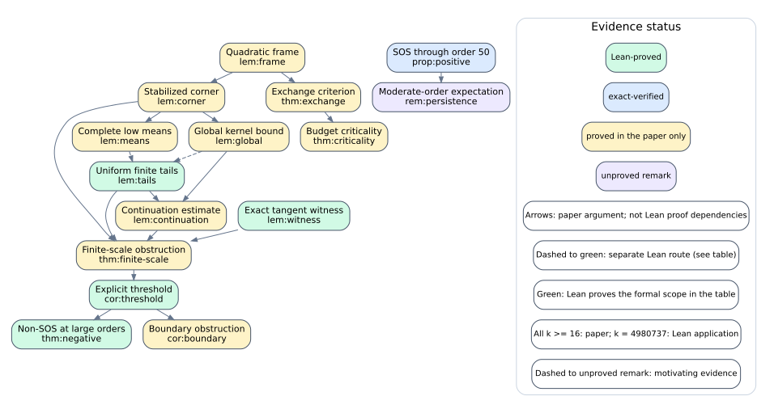

# A guide from the question to the checks

A real Toeplitz matrix has a constant entry along each diagonal: X_ij = x_(i−j).
Choose two such matrices X and Y of order N. Their Böttcher–Wenzel form is

```text
F_N = 2 ||X||_F^2 ||Y||_F^2 - 2 <X,Y>_F^2 - ||XY-YX||_F^2.
```

Here the squared Frobenius norm is the sum of the squared entries, and the
inner product is the sum of the entrywise products. The expression is a
polynomial of degree four in the 4N−2 diagonal variables.

The inequality F_N ≥ 0 says that every choice of real variables gives a
nonnegative number. An SOS representation is stronger: it writes the
polynomial itself as q_1² + ... + q_s², where each q_j is a real homogeneous
quadratic polynomial. Such an identity makes nonnegativity immediate, but
a nonnegative polynomial need not admit one.

For this particular polynomial, SOS holds for 1 ≤ N ≤ 50 and fails for
every N ≥ 2^9961475. The intervening orders, 51 ≤ N < 2^9961475, remain
open. The enormous threshold is sufficient; no smallest bad order is established.

## Three complementary parts

The [paper directory](../paper/) contains the mathematical statements and proofs.
Read [arXiv:2610.08980v1](https://arxiv.org/abs/2610.08980v1) or its
[published PDF](../paper/main.pdf) alongside this guide. All current map numbers
refer to arXiv v1; the [v1.0 map](https://github.com/erenup/toeplitz-bw-not-sos/tree/v1.0/paper-lean-mapping)
refers to the 2 October working version. The negative theorem has a finite analytic
proof; the supplied arithmetic checks establish specific inputs to that
argument, not the analytic implications.

The [Lean project](../lean/) expresses statements and proofs so that the Lean
kernel checks every proof step. It proves the positive range through 20,
the full negative theorem at the displayed threshold, and their structural
and analytic ingredients. The map cites actual theorem declarations. A
proposition definition tells us what a claim means; a theorem proves it.
The enormous powers are handled symbolically in a general proof, without
constructing a matrix of that order.

The [verification programs](../verification/) check the larger positive
certificate chain through 50 and the negative tangent witness. They use
integer or rational arithmetic for every acceptance decision. A floating
factor in the positive checker is merely a proposed certificate: an exact
integer identity and a positivity bound must still hold. Checks that fail
raise an error even when Python runs with `-O`. Deliberately corrupted inputs
exercise these rejection paths on every run.

## Follow a result

For the [positive range](by-section.md#4-exact-certificates), the paper states
an SOS theorem, the Lean declaration proves its subrange through 20, and the
Python program checks 48 exact induction steps to reach 50. The map records
those different scopes explicitly.

For the negative theorem, begin with the exact negative pairing, then follow
the paper argument through the uniform finite-scale estimate, explicit-threshold
proposition, and main theorem. Lean proves the full main theorem, including
the exact witness and its transfer to the literal polynomial. Python provides
an additional arithmetic check of the witness and the paper's error budget.

The graph records dependencies in the paper argument. These edges are not
Lean proof dependencies. A dashed edge into a green node means that Lean
uses a separate formal route; the section table spells out that route.
The generator rejects an unexplained edge from a paper-only statement into
a Lean-proved result. Green refers to the formal scope stated in the table,
which can be narrower than the complete numbered paper statement.

The uniform theorem ranges over **all integers k ≥ 16**. Lean proves the
ingredients and closes the needed application at **k = 4980737**, using
the sharper coefficient-mass bound `3·2^58`; it does not assume an unproved
all-k theorem. Both the SVG and Mermaid legends state this distinction.

[](graph.svg)

The graph covers all 29 numbered theorems, propositions, lemmas and remarks,
plus the numbered example. Equation and section labels appear in `other_labels`
in the map. The two remarks without source labels have stable file/environment
anchors; temporary compilation labels check their numbers without changing the
published sources. The [Mermaid version](graph.md)
also renders on GitHub. The independent positive branch does not imply the
negative theorem.

The arXiv argument presents the finite compression as a Gram-invariant term
minus a Gram-dependent realignment (Lemma 2.6). The frozen proof uses the
kernel cancellation theorem `ToeplitzSOS.Negative.cancellation` and a direct
quantitative witness pairing. In the paper's depth orientation the positive
pure wedge is reversed: `K_paper = -K_Lean`, `E1_paper = -T_Lean`, and
`P_minus,paper = P_plus,Lean`. The table identifies which polynomial and
quantitative statements are proved formally and which complete parametrizations
or qualitative intermediate results have no standalone counterpart.

ArXiv Theorem 3.1, for one symmetric or skew-symmetric factor at every order,
is proved in the paper; it is not part of this repository's Lean formalization.
Its splitting, mixed-pair and window identities have paper-only entries.
Numerical observations in Remarks C.1 and C.2 are labelled separately and are
not used as exact evidence. The five v1.0 numbered items omitted or unnumbered
in arXiv v1, including the exchange and boundary results, are listed in the
[root README](../README.md).

## Reproduce the checks

Follow the complete commands in the [root README](../README.md). They install
the pinned Lean dependencies, run all exact programs in normal and optimized
Python, and build and audit the Lean certificates.

To check the tables and diagrams, install Graphviz (the `dot` command)
and run from the repository root:

```sh
python3 paper-lean-mapping/build_and_check.py
python3 -O paper-lean-mapping/build_and_check.py
```

These commands leave the files unchanged and reject missing or inconsistent
generated files. Tables and Mermaid are checked byte for byte. SVG checks
compare graph identifiers, dependencies, labels, status colours, dashed edges,
and the legend; coordinates, fonts, and rendering order may vary across
Graphviz versions. After editing the map, regenerate explicitly with
`python3 paper-lean-mapping/build_and_check.py --write` and inspect the diff.

Without Graphviz, the default command exits with an installation message.
Use the non-graph mode to check all map data, paper labels, declarations,
section tables, Mermaid, and rejection controls without invoking `dot`:

```sh
python3 paper-lean-mapping/build_and_check.py --no-graph
python3 -O paper-lean-mapping/build_and_check.py --no-graph
```

Its final line adds `; SVG skipped`. It leaves `graph.svg` unchecked and
unchanged. Adding `--write` regenerates only the tables and Mermaid in this
mode. The full command is still needed to validate the SVG.

Expected last line:
`PASS: mapping, DAG, declarations, scripts, and rejection controls (arXiv numbering and frozen tree checked)`.

[`mapping.json`](mapping.json) is the single source for the
[section tables](by-section.md), SVG, and Mermaid graph. Edit it when a result
or its proof status changes. The generator rejects missing paper labels,
dangling or cyclic dependencies, nonexistent Lean declarations, and missing
verification scripts. It also rejects a numbered paper result that lacks its
own entry. The [remaining questions](by-section.md#remaining-questions) list
open mathematical problems and gaps in the formalization.
The checker checks every number against newly compiled `.aux` data, verifies
the published source and PDF digests, and checks each cited declaration against
the frozen Lean tree `69d02281c91fea6ff54fe3556aaddc43eae66e65` at v1.0.
Wrong numbers, labels, source anchors and omitted unlabelled remarks are rejection
controls, including under optimized Python.
Paper-only results include statements whose precise wording is stronger than
the corresponding formal ingredients; the entry explains each difference.

In `mapping.json`, `scope` records what the cited evidence establishes and
any limits; `paper_dependencies` records the written argument; `formal_routes`
explains where the formal proof uses a different or specialized result.
Each checker command appears once in the section table's command catalogue.

Both full and non-graph commands compile a temporary source copy with the
paper build dependencies and take about 3 seconds, using under 100 MiB of memory. Graphviz installation time
depends on the operating system. SVG geometry can vary across versions;
the comparison checks its mathematical content and evidence legend.
