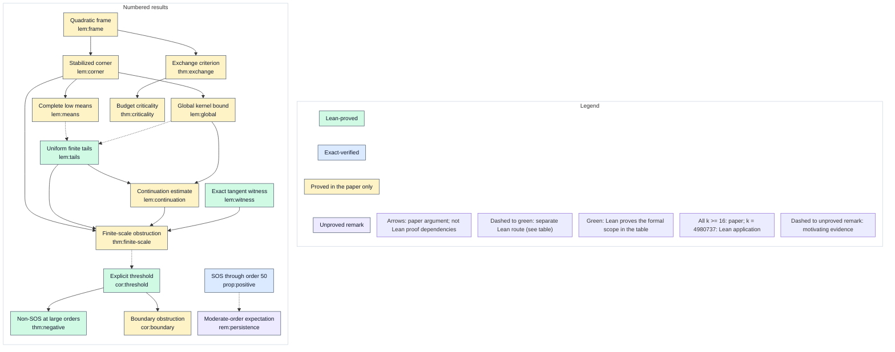

# Dependency graph

Arrows record the paper argument, not Lean proof dependencies. Dashed edges into green nodes use a separate formal route, explained in the section table. Dashed edges into unproved remarks indicate motivation. Green status applies to the formal scope stated in the table. The uniform theorem covers every k >= 16; Lean closes the needed scale k = 4980737 directly. The positive range is a separate branch.

“Proved in the paper only” records an analytic proof. A cited Lean proposition definition does not change that status.
